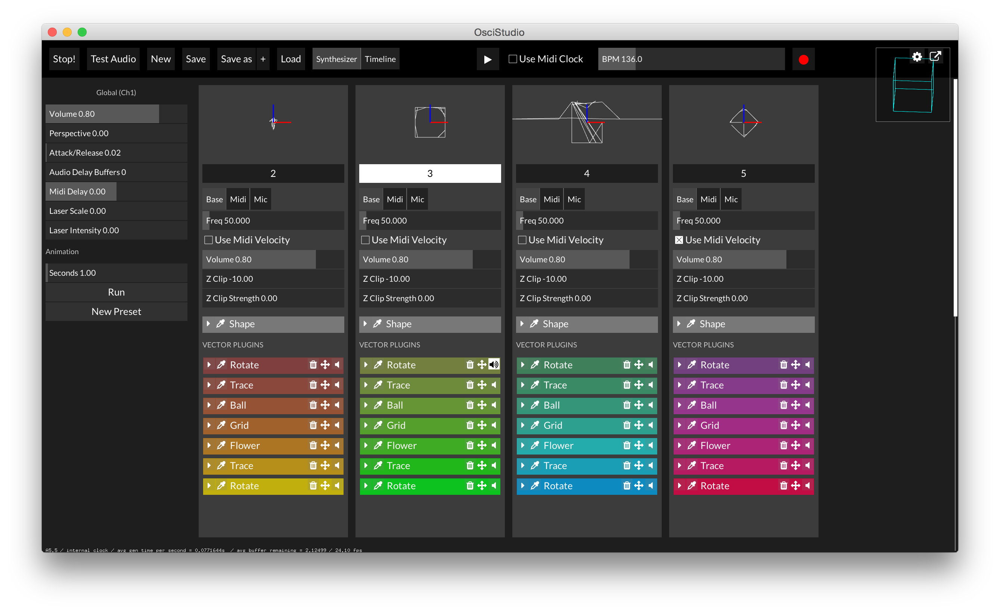
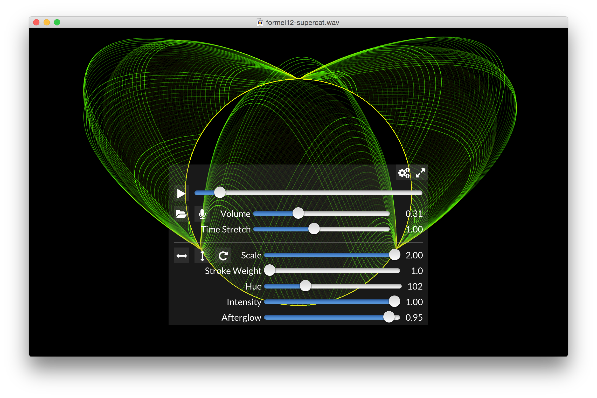

ofxMightyUI
===========

Documentation is not exactly up to date. 


## About

In the long run this is supposed to be a small but flexible 
UI library that runs cross-platform
with multitouch support. 

The library aims to only provide a minimal set of elements 
needed for basic interactive artworks:
sliders, segmented controls, buttons, labels, 
toolbars/navigation bars, internal windows, textfields

ofxMightyUI is a personal project and developed for my specific needs. 

## Screenshots






## TODO

- ☀️ use dependencies instead of including everything (ofxUnicode, ofxEasyRetina, ofxFontStash)
- ☀️ switch from poco events to ofEvent (same behind the scenes, but nicer to use)
- ☀️ moving files around to follow ofx addon standard. already sortof works with project generator. hurray! 
- ⛅️ hm... seems the project generator doesn't set up copying of data files? <br>Yep, that's the case! 
- ☀️ test with new pg (project generator)
- ⛅️ test android (+retina)
- ⛅️ test ios (+retina)
- ⛅️ test windows (hidpi partially supported. needs testing when moving between monitors, needs testing on win10)
- ⛅️ look into stb_textedit https://github.com/nothings/stb/blob/master/stb_textedit.h
- ☀️ see if i can depend on the "proper" ofxFontStash<br>Don't care for now. Waiting for fontstash2 to look
- ☀️ cleanup include structure. how does it even compile? 
- ⛅️ prefix all filenames with `Mui` to avoid include conflicts
- ☁️ create a ofxMightyUI.h that can be included (including MUI.h feels odd in OF)
- ☀️ make a basic example
- ☀️ window size is very confused until the window is resized once (esp one windows) -> seems fine now! 
- ☀️ possible speed gain when combining textureatlas of fontstash and mui ui elements? (no switching textures -> drawArrays becomes non blocking?) --> better to collect draw commands as long as possible. 
- ☁️ include dropdown, instanced listview, and some other classes i have lying around here and there
- ☁️ added de/serialization mechanism to mui::ParameterPanel (either my IO.h, or some built in xml thingie) --> use the code from osci studio? 
- ☁️ add support for ofParameter / ofParameterGroup to parameterpanel? (is it fast enough?, i want something lock free)
- ☁️ create a color picker component
- ☀️ ~~clean up layouting mess --> remove layoutHandler~~, create onLayout event. maybe include the new `L.h` i've been using in my own projects
- ☀️ add event handlers (onTouchDown, onTouchUp, ...)


TODO OSX: 

- ☀️ what is needed for the user to enable retina? [should be supported] -> add the high resolution capable option to the plist
- **Copy Resources**: ```cp -R ../../../addons/ofxMightyUI/bin/data/* "$TARGET_BUILD_DIR/$PRODUCT_NAME.app/Contents/Resources/"``` can this be done with projectgen?  --> not at the moment. not gonna mess around to get this to work. 

TODO WINDOWS: 

- ☀️ what is need to detect retina? (using scaleFactor already works very nicely)
- **Copy Resources**: Go to Project settings, choose "all configurations". Then go to Build Events>Post-Build Events add this to the _command line_: <br>
  		```xcopy /e /i /y "$(ProjectDir)..\..\..\addons\ofxMightyUI\bin\data\mui" "$(ProjectDir)bin\data\mui"```

---


A handy UI addon for [openFrameworks](http://www.openframeworks.cc). 

## Features


This is very much a work in progress. The following works: 

- Windows (draggable, with titles and optional left/right toolbar buttons)
- Labels (with all sorts of alignments)
- Sliders (multitouch enabled, optionally with value labels)
- Buttons
- Textfields (operating system textfield is overlayed during editing so it allows copy&paste)
- Scrollpanes
- Segmented buttons (the equivalent of radio buttons in a way)
- Retina support 


## Setup


Download the current master branch, either as zip or clone from git with

	cd OF/addons
	git clone https://github.com/kritzikratzi/ofxMightyUI.git


### All platforms

Edit `addons.make` and add this line: 

	ofxMightyUI


With this alone makefile builds should already work. 


### iOS 

**outdated, this is much easier now**

- Add the folder addons/ofxMightyUI/src to your XCode project
- Go to Project>Targets>emptyExample>Build Phases>Link Binary with Libraries. Click the '+' icon and add the CoreText framework. 
- Go to Project>Targets>emptyExample>Build Phases>Run Script and add <br>
  	```cp -rf ../../../addons/ofxMightyUI/bin/data/ "$TARGET_BUILD_DIR/$PRODUCT_NAME.app"```

### MacOS X

**outdated, this is much easier now**

- Add the folder addons/ofxMightyUI/src to your XCode project. 
- Go to Project>Targets>emptyExample>Build Phases>Run Script and add <br>
  	```cp -rf ../../../addons/ofxMightyUI/bin/data/ "$TARGET_BUILD_DIR/$PRODUCT_NAME.app/Contents/Resources"```
  	
### Windows

**outdated, this is much easier now**

- Create a groups (filters) for ofxMightyUI
- Add all .cpp and .h from those folders to their respective groups
- Go to Project>Properties, choose "All configurations" from the dropdown on top
- Go to C/C++>General and edit additional include directories. Add the following<br>
		```..\..\..\addons\ofxMightyUI\src```<br>
		```..\..\..\addons\ofxMightyUI\src\fontstash```

- Go to Build Events>Post-Build Events and add this to command line: <br>
  		```xcopy /e /i /y "$(ProjectDir)..\..\..\addons\ofxMightyUI\bin\data\mui" "$(ProjectDir)bin\data\mui"```

### Android

**outdated, this is much easier now**

- Refresh your project view (press F5), the ofxMightyUI subproject should show up
- Right click>Resource Configuration>Exclude From Build>Release and Debug for these folders: 
	- ofxMightyUI/addons/ofxFBO
	- ofxMightyUI/addons/ofxEasyRetina
	- ofxMightyUI/addons/ofxMUI/native
	- ofxMightyUI/addons/ofxMUI/native-osx
	- ofxMightyUI/src
	
Also find the excludes section in config.make and add those same folders: 

	PROJECT_EXCLUSIONS = $(PROJECT_ROOT)/ofxMightyUI/addons/ofxFBO
	PROJECT_EXCLUSIONS += $(PROJECT_ROOT)/ofxMightyUI/addons/ofxEasyRetina
	PROJECT_EXCLUSIONS += $(PROJECT_ROOT)/ofxMightyUI/addons/ofxMUI/native
	PROJECT_EXCLUSIONS += $(PROJECT_ROOT)/ofxMightyUI/addons/ofxMUI/native-osx
	PROJECT_EXCLUSIONS += $(PROJECT_ROOT)/ofxMightyUI/src

## Usage

There's a longer example in the `src/` folder. 


**ofApp.h**

	#include "MUI.h"
	
	class testApp{
		// Root element to which you can add your UI elements
		mui::Root *root;
		
		mui::Button * button;
		mui::SliderWithLabel * slider; 
		
		// callback used for the button onPress
		void onButtonPress( const void* sender, ofTouchEventArgs &args ); 
	}
	
**ofApp.cpp**

	void testApp::setup(){	
		...
		
		// create root element
		// this attaches to OF and handles draw/update/mouse/key/... by itself. 
		root = new mui::Root();
		
		// create button and register add listener
		button = new mui::Button( "Button", 20, 200, 70, 30 ); 
		ofAddListener( button->onPress, this, &testApp::onButtonPress );
		root->add( button ); 
	}
	
	//--------------------------------------------------------------
	void testApp::onButtonPress( const void* sender, ofTouchEventArgs &args ){
		cout << "the button was pressed!" << endl; 
	}

## Components


|Component|Description|
|---------|---|
|Container|Basis for everything. Has (optional) opaque background and takes care of handling touch and key events|
|Root|Takes care of embeding ofxMightyUI into an openFrameworks base class|
|Label|A text label with vertical and horizontal alignment and text color|
|Button|A clickable button with an onPress eventlistener. Contains a label|
|ToggleButton|Same as button, but has two states (selected=true/false)|
|InternalWindow||
|ScrollPane|Takes care of clipping and efficiently display lots of items. Supports scroll wheel and touch scroll, optional paging and autoscroll (for logs). |
|SegmentedSelected|A set of buttons to choose between various options (e.g. color=red/green/blue). Uses templates to attach data to the options|
|Slider|A simple horizontal slider|
|SliderWithLabel|A slider, with a label that displays the current value.|
|TextField|Deprecated! Native textfield overlay. Will be gone soon.|
|TextArea|In progress, unusable. TextField replacement|


## Layouting 

Especially more complex layouts can be tricky to get right. ofxMightyUI uses a very straight forward approach without springs, layout managers or bindings. 

Here is a simple example. We have a form with two labels+sliders (hue and size). 

	#include "MuiL.h" // L for layout ^^
	
	class MyForm : public mui::Container{
		mui::Label * sizeLabel; 
		mui::Slider * sizeSlider; 
		
		mui::Label * hueLabel; 
		mui::Slider * sizeSlider; 
		
		MyForm(){
			sizeLabel = mui::Label("Size:", 0,0,100,30); 
			add(sizeLabel); 
			
			sizeSlider = new mui::Slider(0,0,100,30, 100,200,150 ); // a slider 100x30 large, values 100.200, default 150
			add(sizeSlider); 
			
			hueLabel = new mui::Label("Hue:", 0,0, 100,30); 
			add(hueLabel); 
			
			hueSlider = new mui::Slider(0,0,100,30, 100,200,150 ); // a slider 100x30 large, values 100.200, default 150
			add(hueSlider); 
		}
		
		~MyForm(){
			delete sizeLabel; 
			delete sizeSlider; 
			delete hueLabel; 
			delete hueSlider; 
		}
		
		// call on the first frame, and whenever the size of the window changes
		void layout(){
			// move the size label 10 px from top left
			mui::L(sizeLabel).posTL(10,10); 
			
			// place the slider next to the label (5px space), and use all available width (minus ten pixels)
			mui::L(sizeSlider).rightOf(sizeLabel, 5); 
			
			// place the hue label below the size label, leaving a 5 px space. 
			mui::L(hueLabel).below(sizeLabel,5); 
			
			// and the hue slider next to the hue label. 
			mui::L(hueSlider).rightOf(hueLabel, 5); 
			
			// in this case, we want our own size 
			ofRectangle size = getChildBounds(); 
			width = size.width; 
			height = size.height; 
		}
	};


## Events/Listeners

All events (update,draw,mouse,touch,keyboard,layouting) can be intercepted with lambda functions. 

See `Container.h` for a full list. 

	// create a button with a border 
	mui::Button * button = new mui::Button(); 
	button->onDraw.add([button](){
		// red when over, otherwise gray
		if(isMouseOver()) ofSetColor(255,0,0); 
		else ofSetColor(150); 
		
		ofDrawRectangle(0,0,button->width,button->height); 
		ofSetColor(255); // always reset to white after drawing!
	});
	


## Licensing 

Third party software/assets used: 

- ofxFontStash2 / fontstash (MIT license?)
- [CppTweener](http://code.google.com/p/tweener/): MIT License
- [iPhone4 GUI for Photoshop](http://www.teehanlax.com/blog/2010/08/12/iphone-4-gui-psd-retina-display/) cc-sa-by
- [Lato Regular font](http://www.fontsquirrel.com/fonts/lato): Sil open font license
 
The project itself is released under the [MIT](https://opensource.org/licenses/MIT) License. 

